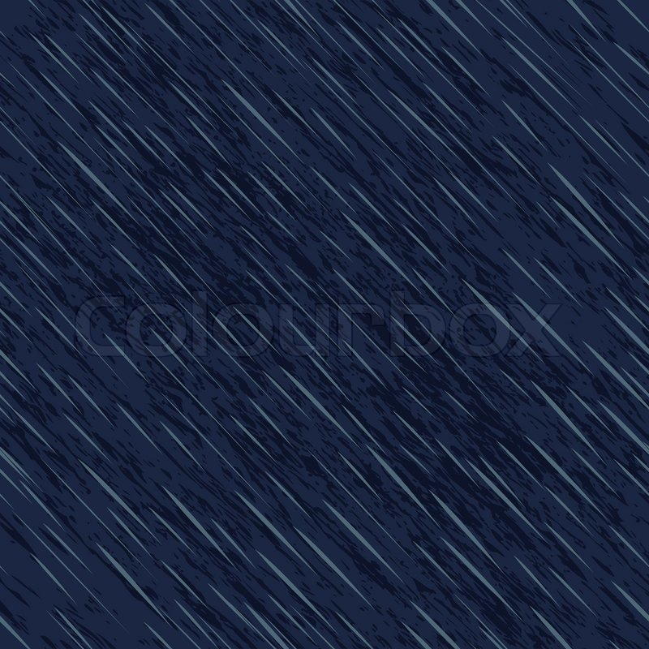
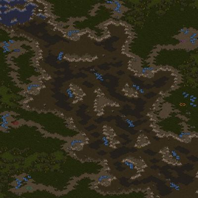

# wdi-project-one

<!-- # **BATTLE COMMAND** -->

### A vanilla JavaScript game built for the browser

## Table of Contents
* [Brief](#brief)
* [Tech Used](#tech)
* [Process](#process)
* [Challenges](#challenges)
* [Wins](#wins)
* [Next Up](#next)
* [Game Instructions](#instructions)

## <a name="brief"></a>Brief

Technical Requirements:
- Render a game in the browser
- Design logic for winning & visually display which player won
- Include separate HTML / CSS / JavaScript files
- Stick with KISS (Keep It Simple Stupid) and DRY (Don't Repeat Yourself) principles
- Use Javascript or jQuery for DOM manipulation
- Deploy your game online, where the rest of the world can access it
- Use semantic markup for HTML and CSS (adhere to best practices)

Deliverables:
- A working game, built by you, hosted somewhere on the internet
- A link to your hosted working game in the URL section of your Github repo
- A git repository hosted on Github, with a link to your hosted game, and frequent commits dating back to the very beginning of the project

<hr>

## <a name="tech"></a>Technologies Used:

`Vanilla Javascript`
`SASS (SCSS)`
`CSS3`
`HTML5`
`Git`
`jQuery`
`Atom`
`GitHub`
`Trello`
> - Fonts from [1001Fonts](https://www.1001fonts.com/)
> - Sounds from [Sounds Bible](http://soundbible.com/)

<hr>

## <a name="process"></a>The Process
### Planning
The initial planning phase centred around determining an MVP for the game. For Battle Command, it was to have two elements which could 'shoot' elements at each other, recognise that they had been hit and to reduce the life of the impacted element.

After fleshing out MVP I used [Trello](https://trello.com/b/cXEbOHhc)  to list out and track all the tasks that need doing to reach it.

 

 I also thought out additional features that could be added to the game once MVP had been reached which were also added to Trello.

### The Build
My plan was to start with the smallest possible piece and work upwards towards a fully functioning game. For Battle Command this was being able to move an element around the game board using the arrow keys.

Understanding how to do this then allowed me to take on the challenge of collision detection, bullet propulsion, bullet collision management and ultimately obstical management.

I primarily made use of ES6 `class` syntax, to create the game board elements. This proved to be particularly useful for managing the many bullets on the board and later on the variable number of obsticals.

After reaching MVP the focus shifted to making the game fun to play by jazzing up the styling and adding some graphics and sound effects to the game elements. Finally I added some additional features to the games like randomly placed obstacle with differing effects on the game and even a speed power up.

<hr>

## <a name="challenges"></a>Challenges

- collision detection
- bullet and game piece management and control
- random obstical placement
- obstical effects on tanks and bullets
  - marsh slowing pieces tanks down
- power-ups moving around the board at random intervals


The initial challenge that I needed to solve was how to detect collisions between elements on the board and to be able to move an element on the board using the arrow keys. Once this was solve


<hr>

## <a name="wins"></a>Wins
While collision detection and management of multiple bullets and bullet collisions was certainly a big challenge, as I did not know how to do this initially, resulting in major wins, my favourite bits of code and the pieces I am most proud of are the interaction between the game elements and obsticals.

The `move()` method below is the heart of the game and my favourite piece of code. The method is responsible for taking in a direction of a tank or a bullet and moving it across the game board at the elements specific speed. It checks for collisions every time it updates the elements position and will determine a different results depending on what has collided with what. Adimitedly the method is rather verbose and could be re-factored considerably. See whats next to understand more on this.

``` JavaScript
  move(direction) {
    const newPosition = {
      left: this.left,
      top: this.top,
      width: this.width,
      height: this.height
    };

    const speed = this.movementSpeed;

    switch(direction){
      case 'left':
        newPosition.left -= speed;
        this.direction = 'left';
        break;...
        // Three additional conditions for top, bottom & left
      }

      if(!positionIsOnBoard(newPosition.top, newPosition.left, this.width,  this.height)){
        return false;
      }

      const overlappingObjects = objectOverlapsObjects(this, newPosition,   gameItems);

      if(overlappingObjects){
        const collidedWith = overlappingObjects[0].object.name;
        const collidingItemType = this.type;

        if(collidedWith === 'Water' && collidingItemType === 'tank'){
          gameEndWater(this.name);

        }else if((collidedWith === 'Water' || collidedWith === 'Marsh' ||   collidedWith === 'SpeedUp') && collidingItemType === 'bullet'){
          //const nothing = 'do nothing';
        }else if(collidedWith === 'SpeedUp' && collidingItemType === 'tank'){
          this.movementSpeed = 30;
          setTimeout(()=>{
            this.movementSpeed = 10;
          }, 7000);

        }else if(collidedWith === 'Marsh' && collidingItemType === 'tank'){
          const stickFactor = overlappingObjects[0].object.movementSpeed;
          switch(direction){
            case 'left':
            newPosition.left += speed - stickFactor;
            this.direction = 'left';
            break;...
            // Three other conditions for `right`, `up` and `down`  
          }
        }else{
          return overlappingObjects;
        }
      }

    this.left = newPosition.left;
    this.top = newPosition.top;
    this.domElement.setAttribute('class', direction);
    return true;
  }

```

<hr>

## Next up

<hr>

## Game Instructions:

**Aim:** Two players go head to head, controlling battle tanks in an attempt to destroy each other.

> Avoid the various terrain or use them to your advantage
> -   **Water:** End your career as a tank commander. *GAME OVER*

> -  **Mountains:** Will block your path but can also provide cover from incoming enemy fire.

> -  **Wetland:** Will slow you down and make you a sitting duck for your enemy.


> Keep your eyes out for the transient speed ***power up***.
> -  This bad boy will increase your speed for 5seconds giving you and unfair advantage over your enemy. Beware of the terrain obstacles while you whizz around.

> ### Player one controls
> - `^`       up
> - `v`       down
> - `<`       left
> - `>`       right
> - `Space`   fire cannon


> ### Player Two controls
> - `W`       up
> - `S`       down
> - `A`       left
> - `D`       right
> - `Shift`   fire cannon
